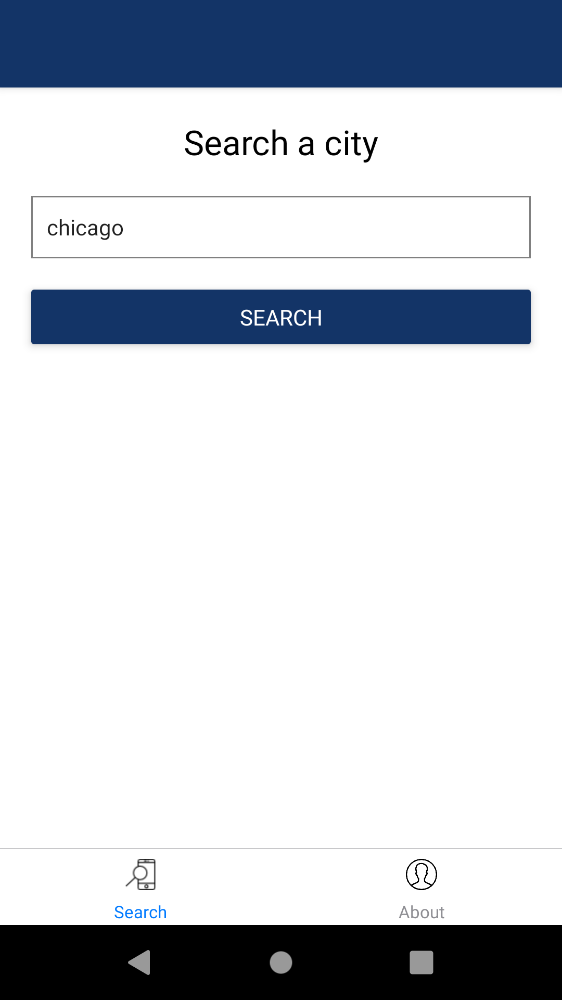
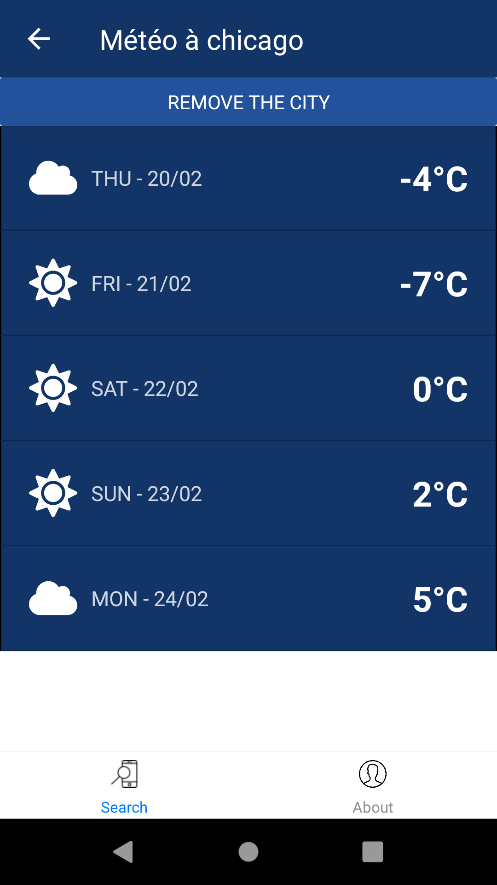
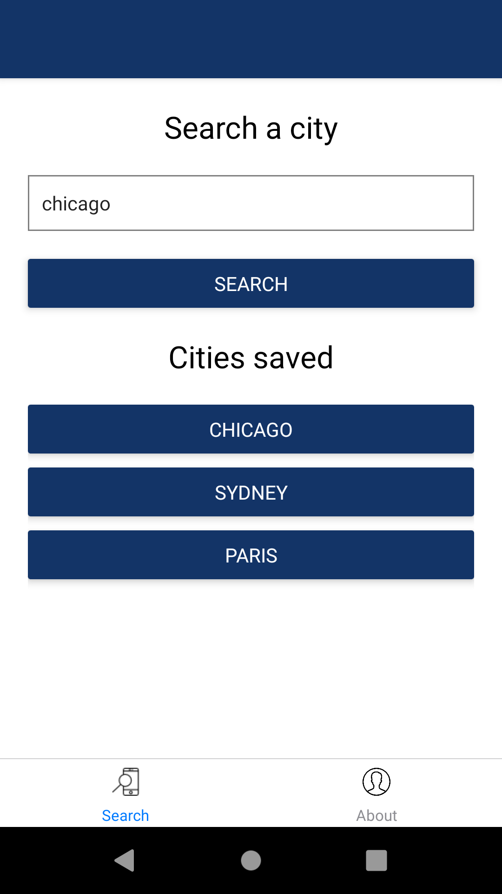

# React Native Weather

This project was bootstrapped with [React Native CLI](https://facebook.github.io/react-native/docs/getting-started).

Sample weather app inspired from [Grafikart video](https://www.youtube.com/watch?v=Y7rbJRjaYCY).

|  |  |  |
|-------------------------------------------------------|-------------------------------------------------------|-------------------------------------------------------|

## Available Scripts

In the project directory, you can run:

### `yarn start`

Runs the Javascript server.

### `yarn android`

Runs the app in the Android emulator (need Android Studio).

### `yarn ios`

Runs the app in the iOS emulator (need XCode).

### `yarn lint`

Runs ESLint on source files.

## Licence

`react-native-weather` is licensed under the [MIT License](http://opensource.org/licenses/MIT).

Created with ♥ by [@yoriiis](http://github.com/yoriiis).